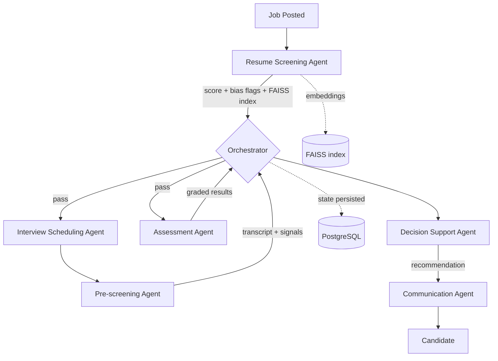

# TalentFlow AI — Autonomous Multi-Agent Talent Acquisition System

An autonomous, multi-agent recruitment platform that automates the full hiring
pipeline — from resume screening to hiring decisions — using coordinated LLM
agents, RAG-style semantic search, and bias-aware scoring.

> Built as a portfolio project using the same stack as the author's other
> GenAI projects (LangChain/LangGraph, FAISS, Hugging Face embeddings,
> Gemini API, MCP), applied to a recruiting domain and served through
> FastAPI.
---

## Why this exists

Traditional recruitment is slow and inconsistent:

| Problem | Cost |
|---|---|
| Manual resume screening | ~60% of recruiter time |
| Time-to-hire | 42 days average |
| Bad hires from inconsistent, biased decisions | $240B/yr industry-wide |

TalentFlow AI addresses this by giving every stage of the pipeline a
dedicated, auditable agent, coordinated by a central orchestrator instead of
one monolithic prompt.

---

## Architecture



**Orchestrator** — a LangGraph state machine that routes a candidate
through stages, persists state to Postgres after every transition, and can
short-circuit (auto-reject below threshold, auto-escalate on bias-flag).

**Agents** (`app/agents/`) — each agent is a small, single-responsibility
class with its own prompt, tools, and output schema, so it can be tested,
swapped, or re-run independently of the others.

| Agent | Responsibility | Key tech |
|---|---|---|
| `ResumeScreeningAgent` | Parse resume, embed + compare to JD, skill-match, flag PII for bias-blind scoring, index into FAISS | Sentence-Transformers, FAISS |
| `InterviewSchedulingAgent` | Find mutual availability, send invites, handle reschedules | Calendar service (mockable) |
| `PrescreeningAgent` | Conduct a structured text-based pre-screen (agentic chat), extract signals | Gemini API |
| `AssessmentAgent` | Administer + auto-grade technical assessments against a rubric | Gemini API |
| `DecisionSupportAgent` | Aggregate weighted scores into a recommendation, surface bias risk | Gemini API + rules |
| `CommunicationAgent` | Stage-aware candidate messaging (templated, tone-controlled) | Email service (mockable) |

Two extra surfaces sit on top of the agent pipeline:

- **MCP server** (`app/mcp_server.py`) — exposes `search_candidates`,
  `get_candidate_status`, `score_resume_against_job`, and `list_open_jobs`
  as MCP tools, so any MCP-compatible client (Claude Desktop, an MCP
  Inspector, or your own agentic chatbot) can drive the pipeline with
  natural language — the same tool-integration pattern as the RAG/MCP
  chatbot project, applied to recruiting.
- **Streamlit dashboard** (`streamlit_app.py`) — a recruiter-facing UI to
  post jobs, run candidates through the pipeline, watch the agent trace,
  and run FAISS semantic search across the candidate pool.

---

## Tech stack

- **Orchestration:** LangGraph (state machine over agents)
- **LLM:** Google Gemini API (`gemini-2.0-flash`)
- **Embeddings:** Hugging Face `sentence-transformers/all-MiniLM-L6-v2`
- **Vector store:** FAISS (candidate semantic search, RAG-style retrieval)
- **Tool protocol:** MCP (Model Context Protocol) server for agentic clients
- **API:** FastAPI
- **DB:** PostgreSQL + SQLAlchemy (Dockerized)
- **Dashboard:** Streamlit
- **Infra:** Docker Compose (api + db)

---

## Project layout

```
talent-acquisition-agent/
├── app/
│   ├── agents/          # one file per agent + orchestrator.py (LangGraph)
│   ├── api/routes/      # FastAPI endpoints
│   ├── models/          # SQLAlchemy ORM models
│   ├── schemas/         # Pydantic request/response schemas
│   ├── services/        # embeddings, FAISS store, bias detection, calendar, email, Gemini client
│   ├── mcp_server.py    # MCP tool server
│   ├── config.py
│   ├── database.py
│   └── main.py
├── streamlit_app.py     # recruiter dashboard
├── tests/
├── docker-compose.yml
├── requirements.txt
└── .env.example
```

---

## Getting started

```bash
git clone <this-repo>
cd talent-acquisition-agent
cp .env.example .env        # add your GEMINI_API_KEY (or leave USE_MOCK_LLM=true)
docker compose up --build   # starts Postgres + API on :8000
```

Or run locally without Docker:

```bash
python -m venv venv && source venv/bin/activate
pip install -r requirements.txt
uvicorn app.main:app --reload
```

Visit `http://localhost:8000/docs` for interactive API docs.

### Recruiter dashboard

```bash
streamlit run streamlit_app.py
```

### MCP server (for agentic clients)

```bash
python -m app.mcp_server
```

### Try the pipeline via API

```bash
curl -X POST localhost:8000/api/jobs -H 'Content-Type: application/json' -d '{
  "title": "Backend Engineer",
  "description": "5+ years Python, FastAPI, distributed systems...",
  "required_skills": ["python", "fastapi", "postgresql", "distributed systems"]
}'

curl -X POST localhost:8000/api/pipeline/run -H 'Content-Type: application/json' -d '{
  "job_id": 1,
  "resume_text": "..."
}'

# Semantic search across every screened candidate (FAISS)
curl "localhost:8000/api/candidates/search?query=backend%20engineer%20with%20distributed%20systems"
```

This kicks off the orchestrator, which screens the resume, indexes it into
FAISS, and — if it clears the bar — schedules the next stage automatically.

---

## Bias-aware design

Rather than bolt bias-detection on as an afterthought, the pipeline is built
around it:

1. `bias_detection.py` strips/flags PII (name, age, gender-coded terms,
   photos, graduation years) **before** the resume ever reaches the scoring
   step, so scoring reflects substance, not identity.
2. `DecisionSupportAgent` can re-run a parity check across flagged
   demographic proxies in aggregate (not per-candidate) and surfaces a
   warning if a protected group is being screened out at a disproportionate
   rate — this is a signal for a human reviewer, not an auto-decision.
3. Every agent decision is logged to a structured trace (see the `trace`
   field in the pipeline response), so recommendations are auditable after
   the fact.

This is a portfolio-grade implementation of the *pattern*, not a certified
EEOC-compliant system — see `app/services/bias_detection.py` for what's
implemented vs. what a production system would need (legal review, audited
fairness metrics, human-in-the-loop sign-off).

---

## What's implemented vs. stubbed

To keep this runnable without external accounts, external integrations are
behind clean interfaces with mock implementations by default:

- ✅ **Real logic:** resume parsing, embedding similarity, FAISS indexing +
  semantic search, skill matching, bias-flagging, weighted decision
  aggregation, LangGraph orchestration state machine, MCP tool server
- 🔌 **Mockable (swap in real credentials):** calendar (Google Calendar),
  email (SMTP/SendGrid), Gemini calls (`GEMINI_API_KEY`)

Swapping a mock for the real thing is a one-file change in `app/services/`.

---


---

## License

MIT — use freely for learning or as a base for your own project.
